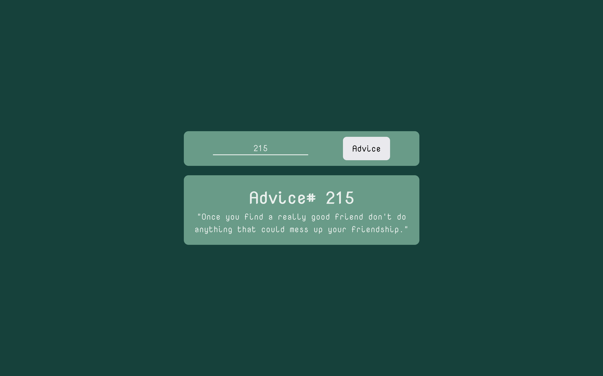

# Frontend Mentor - Advice generator app solution

This is a solution to the [Advice generator app challenge on Frontend Mentor](https://www.frontendmentor.io/challenges/advice-generator-app-QdUG-13db). Frontend Mentor challenges help you improve your coding skills by building realistic projects.

## Table of contents

- [Overview](#overview)
  - [The challenge](#the-challenge)
  - [Screenshot](#screenshot)
  - [Links](#links)
- [My process](#my-process)
  - [Built with](#built-with)
  - [What I learned](#what-i-learned)
  - [Continued development](#continued-development)
  - [Useful resources](#useful-resources)
- [Author](#author)

## Overview

### The challenge

Users should be able to:

- View the optimal layout for the app depending on their device's screen size.
- See hover states for all interactive elements on the page.
- Generate a new piece of advice by entering a number and clicking the advice button.

### Screenshot




### Links

- Solution URL: [Add solution URL here](https://your-solution-url.com)
- Live Site URL: [Add live site URL here](https://your-live-site-url.com)

## My process

### Built with

- HTML5 markup
- CSS custom properties
- Flexbox
- Mobile-first workflow

### What I learned

```js
const generatorAdvice = async () => {};
```

### Continued development

- Dialog Element
- Javascript Json
- Javascript Asynchronous

### Useful resources

- [Exploring HTML dialog element with examples](https://dev.to/atapas/exploring-html-dialog-element-with-examples-2c43) - The examples in this article helped me to understand how to use the dialog element.

## Author

- Frontend Mentor - [@mayor-creator](https://www.frontendmentor.io/profile/mayor-creator)
- Threads - [@mayor_crearor](https://www.threads.net/@mayor_creator)
